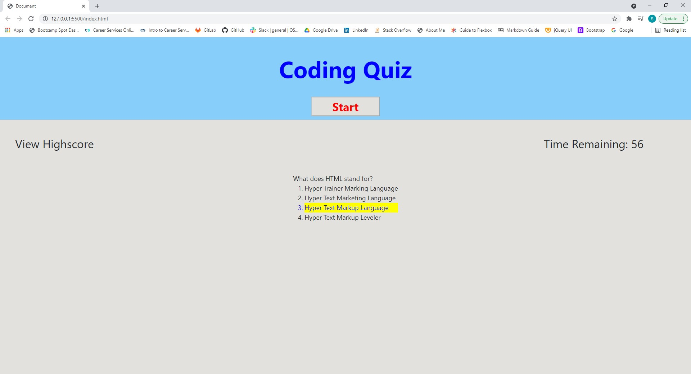

# Code-Quiz
Created by Shawn Miller

# Technologies Used
- HTML
- CSS
- Javascript
- Jquery

# Description
This website was made create a quiz for a user to take. The user will have sixty seconds to complete ten questions. If a user finishes the questions or time runs out the website will ask the user for their initials and show their result of the quiz. As a user answers the questions the website will display if the answers are correct or incorrect. If an answer is incorrect the user will lose ten seconds from the timer. The users initials will be saved with their score to the local drive. A user can view the high scores from a menu on the left side of the screen.

# Appearance

# Known Bugs
The highscores section will not appear and populate when clicked on.

## Contact info
shawnsmm@gmail.com